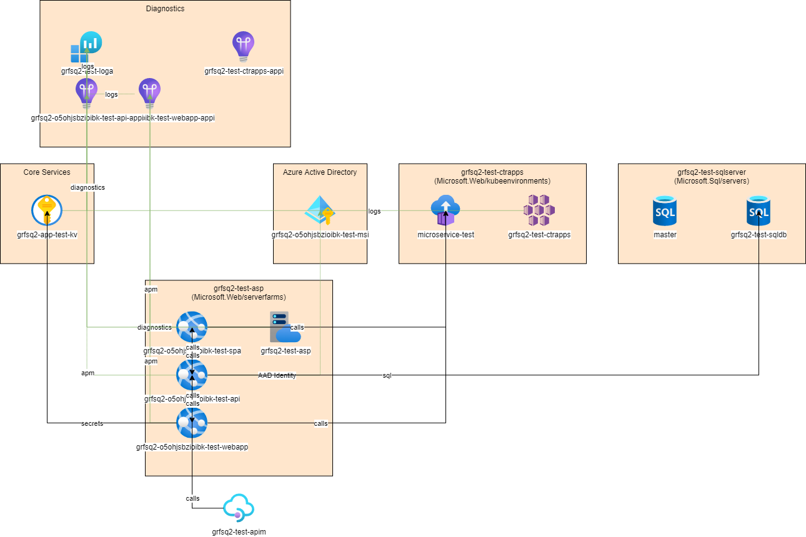
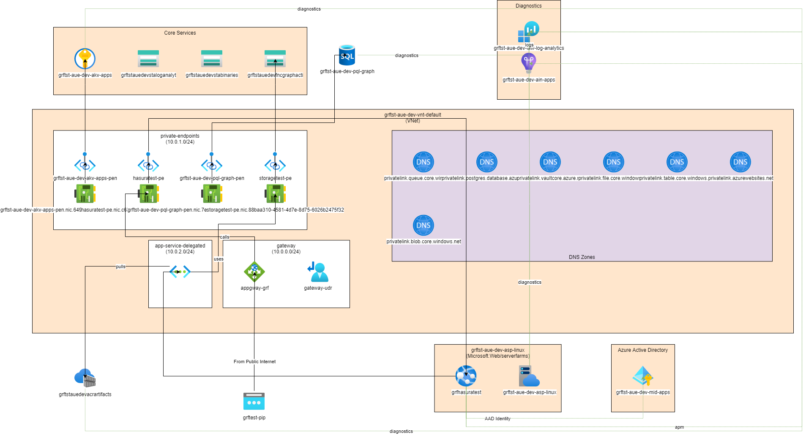

# AzureDiagrams

## Generate a Draw.IO diagram from your Azure Resources

TLDR;

```bash
dotnet tool install --global AzureDiagramGenerator

az login

AzureDiagramGenerator --subscription-id <subscription-id> --resource-group <resource-group> --resource-group <resource-group> --showRuntime --output c:/temp/
```

## CLI flags

| Flag                | Required  | Description                                                                  |
|:--------------------|:----------|:-----------------------------------------------------------------------------|
| --tenant-id         | No        | Tenant Id (defaults to current Azure CLI)                                    |
| --subscription      | Yes       | Subscription Id to run against                                               |
| --resource-group    | Yes       | Wildcard enabled resource group name (supports multiple)                     |
| --output            | Yes       | Folder to output diagram to                                                  |
| --condensed         | No        | True collapses private endpoints into subnets (can simplify large diagrams)  |
| --show-runtime      | Yes       | True to show runtime flows defined on the control plane                      |
| --show-inferred     | Yes       | True to infer connections between resources by introspecting appSettings     |
| --show-identity     | Yes       | True to show User Assigned Managed Identity connections                      |
| --show-diagnostics  | Yes       | True to show diagnostics flows                                               |
| --token             | No        | Optional JWT to avoid using CLI credential                                   |
| --output-file-name  | No        | Name of generated file. Defaults to resource-group name                      |


# Github Actions

We have two different actions. The first runs as a Docker action, and produces a jpeg output. The second doesn't use docker, and produces a .drawio file.

 - [graemefoster/azurediagramsgithubactionsdocker@v0.1.2](https://github.com/graemefoster/AzureDiagramsGithubActionsDocker)
 - [graemefoster/azurediagramsgithubactions@v0.1.1](https://github.com/graemefoster/AzureDiagramsGithubActions)


## Example outputs
### Azure App Service with App Insights / database / Key Vault


### More complex with VNets and private endpoints


## How does it work?
AzureDiagrams queries the Azure Resource Management APIs to introspect resource-groups. It then uses a set of strategies to enrich the raw data, building a model that can be projected into other formats.

It's not 100% guaranteed to be correct but it should give a good first pass at fairly complex architectures/

To layout the components I use the amazing [AutomaticGraphLayout](https://github.com/microsoft/automatic-graph-layout) library.

## Todo
There are many, many Azure services not yet covered. I'll try and put a table here of what is covered, and how comprehensive it is covered.

## Output Formats
The initial version supports Draw.IO diagrams. 


