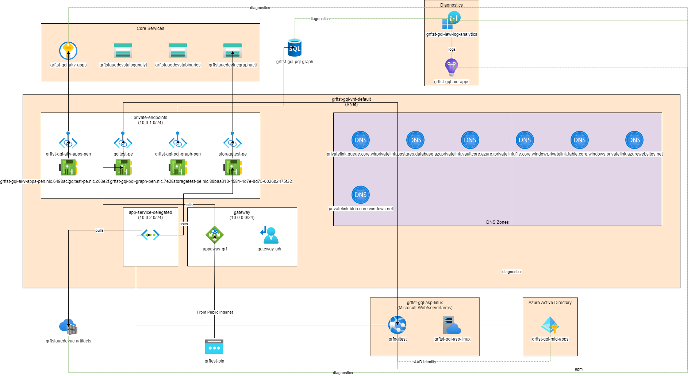

# AzureDiagrams

## Generate a Draw.IO diagram from your Azure Resources

### Github Action

You need to an AAD token to use AzureResourceMap with at least Reader scope over the resource-groups. 
Here's an example that:
- will get a token
- use the Custom Github Action to generate a diagram
- publish the diagram as an artefact.


```yaml
      - name: "Get access token"
        id: token
        run: |
          token=$(az account get-access-token --query accessToken -o tsv --query "accessToken")
          echo "::add-mask::$token" 
          echo "::set-output name=token::$token"

      - name: graemefoster-azurediagrams-action
        uses: graemefoster/AzureResourceMap@v0.5.17
        with:
          subscriptionId: ${{ secrets.AZURE_SUBSCRIPTION_ID }}
          resourceGroup: "*-grf-*"
          outputFileName: "azurediagram.drawio"
          accessToken: ${{ steps.token.outputs.token }}

      - uses: actions/upload-artifact@v3
        with:
          name: diagram
          path: ./azurediagram.drawio
```
## Yaml properties

| Property          | Required  | Description                                                                  |
|:------------------|:----------|:-----------------------------------------------------------------------------|
| subscriptionId    | Yes       | Subscription Id to run against                                               |
| resourceGroup     | Yes       | Wildcard enabled resource group name (supports multiple)                     |
| accessToken       | Yes       | Optional JWT to avoid using CLI credential                                   |
| condensed         | Yes       | True collapses private endpoints into subnets (can simplify large diagrams)  |
| showRuntime       | Yes       | True to show runtime flows defined on the control plane                      |
| showInferred      | Yes       | True to infer connections between resources by introspecting appSettings     |
| showIdentity      | Yes       | True to show User Assigned Managed Identity connections                      |
| showDiagnostics   | Yes       | True to show diagnostics flows                                               |
| outputPng         | Yes       | True to export a png of the draw.io diagram                                  |

### CLI

```bash
az login 
az account set --subscription "<subscription-name>"
dotnet AzureDiagrams.dll --subscription-id <subscription-id> --resource-group <resource-group> --resource-group <resource-group> --output c:/temp/
```

## CLI flags

| Flag                | Required  | Description                                                                  |
|:--------------------|:----------|:-----------------------------------------------------------------------------|
| --tenant-id         | No        | Tenant Id (defaults to current Azure CLI)                                    |
| --subscription      | Yes       | Subscription Id to run against                                               |
| --resource-group    | Yes       | Wildcard enabled resource group name (supports multiple)                     |
| --output            | Yes       | Folder to output diagram to                                                  |
| --condensed         | No        | True collapses private endpoints into subnets (can simplify large diagrams)  |
| --show-runtime      | Yes       | True to show runtime flows defined on the control plane                      |
| --show-inferred     | Yes       | True to infer connections between resources by introspecting appSettings     |
| --show-identity     | Yes       | True to show User Assigned Managed Identity connections                      |
| --show-diagnostics  | Yes       | True to show diagnostics flows                                               |
| --token             | No        | Optional JWT to avoid using CLI credential                                   |
| --output-file-name  | No        | Name of generated file. Defaults to resource-group name                      |


## Example outputs
### Azure App Service with App Insights / database / Key Vault


### More complex with VNets and private endpoints


## How does it work?
AzureDiagrams queries the Azure Resource Management APIs to introspect resource-groups. It then uses a set of strategies to enrich the raw data, building a model that can be projected into other formats.

It's not 100% guaranteed to be correct but it should give a good first pass at fairly complex architectures/

To layout the components I use the amazing [AutomaticGraphLayout](https://github.com/microsoft/automatic-graph-layout) library.

## Todo
There are many, many Azure services not yet covered. I'll try and put a table here of what is covered, and how comprehensive it is covered.

## Output Formats
The initial version supports Draw.IO diagrams. 


